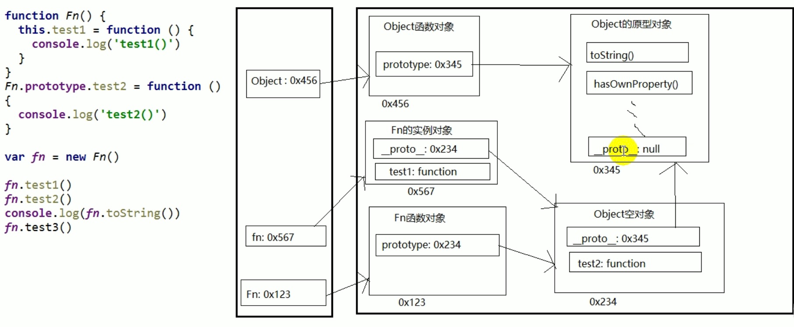

## Data type

### Primitive type(基本数据类型)

String

Number

Boolean

Null

Undefined

### 引用数据类型

Object

 
# 对象

## 分类

1 内建对象
- 由ES标准中定义的对象，在任何ES实现中都可以使用
     - 例如Math String Number Boolean Function Object...

2 宿主对象

	- 由JS运行环境提供的对象，目前主要指浏览器提供的对象
	- 例如BOM DOM
	- Console.log()  document.write()

3 自建对象

 - 由开发人员自己创建的对象

# 原型链

