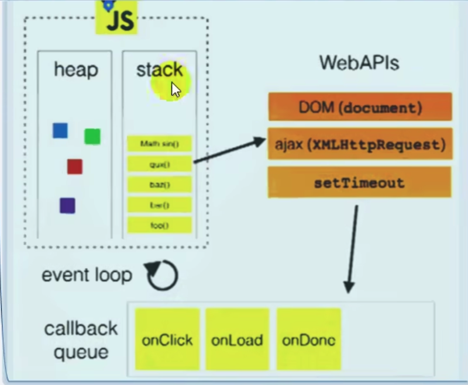
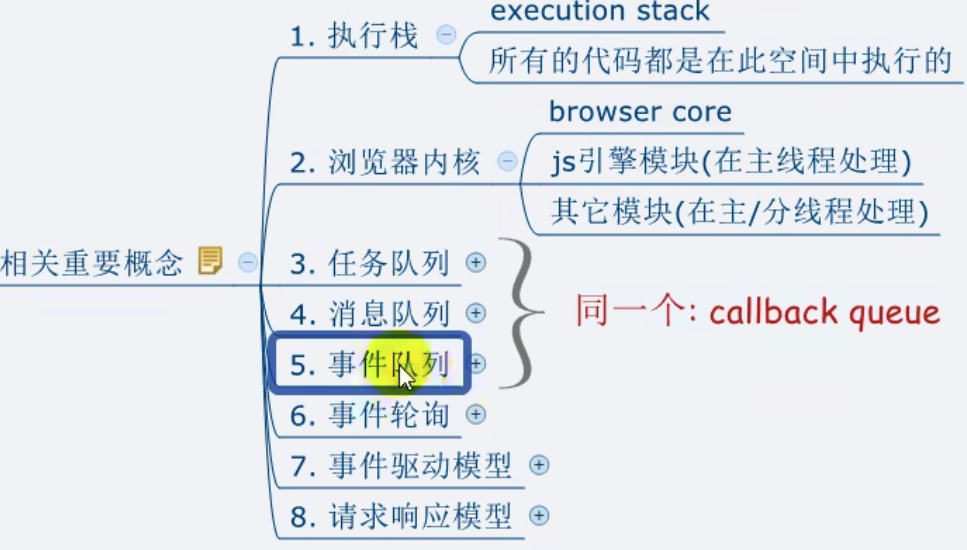

## Data type

### Primitive type(基本数据类型)

String

Number

Boolean

Null

Undefined

### 引用数据类型

Object

 
# 对象

## 分类

1 内建对象
- 由ES标准中定义的对象，在任何ES实现中都可以使用
     - 例如Math String Number Boolean Function Object...

2 宿主对象

	- 由JS运行环境提供的对象，目前主要指浏览器提供的对象
	- 例如BOM DOM
	- Console.log()  document.write()

3 自建对象

 - 由开发人员自己创建的对象

# 原型链

# JS模型原理
  * 两个重要组成部分
    * 事件管理模块
    * 回调队列

# 浏览器内核模块组成
* 主线程
  * js引擎模块： 负责js程序的编译与运行
  * html,css文档解析模块：负责页面文本的解析
  * DOM/CSS模块：负责dom/css在内存中的相关处理
  * 布局和渲染模块：负责页面的布局和效果的绘制（内存中的对象）
* 分线程
  * 定时器模块：负责定时器的管理
  * DOM事件模块：负责事件的管理
  * 网络请求模块：负责Ajax请求